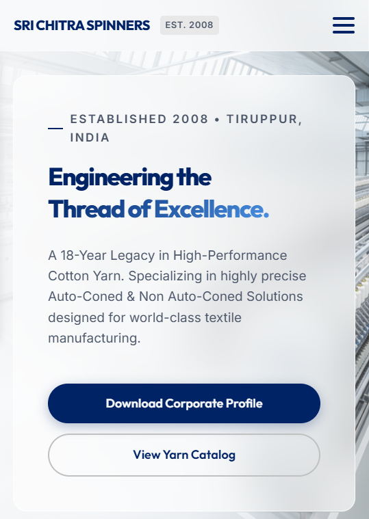
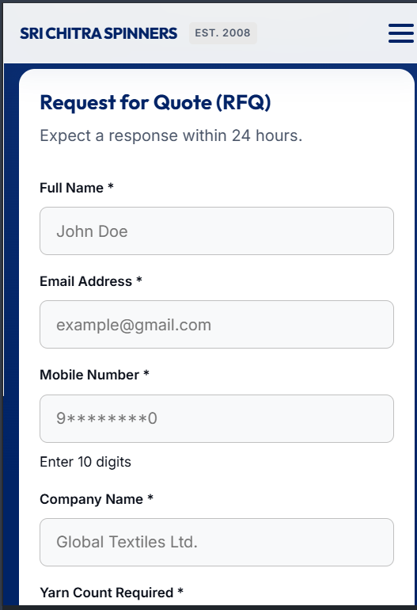
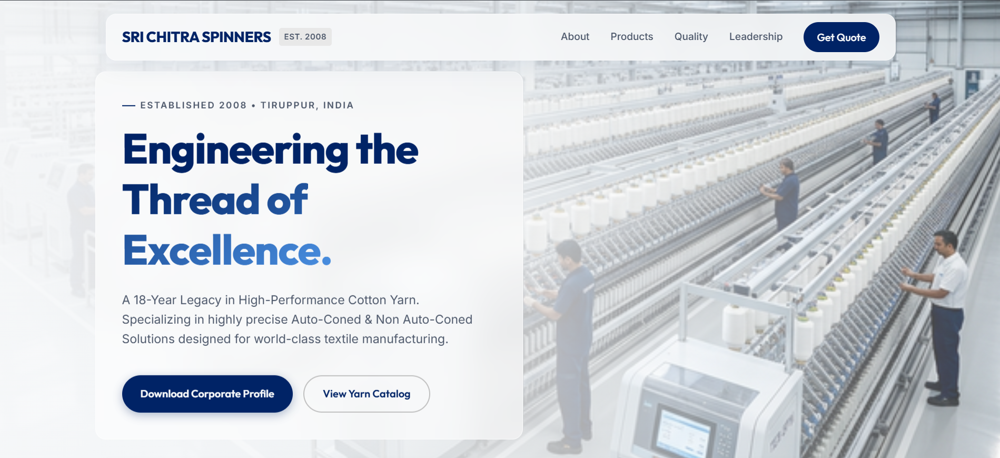

# Sri Chitra Spinners

Live website: https://srichitraspinners.netlify.app/

Sri Chitra Spinners is a cotton yarn manufacturing company based in Tiruppur, India. The site presents the company profile, product verticals, technical specifications, quality process, leadership, and an RFQ contact section for business enquiries.

## Technical stack

- HTML5 for semantic page structure
- CSS3 for layout, cards, gradients, and responsive design
- Vanilla JavaScript for navigation, counters, and form behaviour
- Google Fonts for the site typography
- html2pdf.js for the corporate profile download flow
- Netlify for free static hosting and deployment

## What the site includes

- Hero section with brand positioning and corporate profile download CTA
- Capacity and company highlight cards
- Product showcase for Auto-Coned Yarn and Industrial Non Auto-Coned Yarn
- Technical specifications table
- Quality assurance process section
- Leadership and founding team section
- RFQ enquiry form with direct contact options
- Footer with business, compliance, and map details

## RFQ form

The Request for Quote form is built for B2B lead capture. It collects:

- Full name
- Email address
- Mobile number
- Company name
- Required yarn count
- Required quantity in bags or tons

The form also includes basic input validation and a bot-check field to reduce spam submissions.

## Key features

- Mobile-friendly responsive layout
- Clean industrial visual style with glass-panel sections
- Animated counters and reveal effects
- Direct phone and email contact links
- Google Maps link for factory location


## Project structure

- `index.html` - main website markup
- `style.css` - page styling
- `main.js` - interactive behaviour and UI logic
- `config.js` - site configuration values
- `assets/` - images and media used on the page

## Local development

Open the project folder in a browser or run it through a local server. For example, with VS Code Live Server or any static file server:

```powershell
python -m http.server 8000
```

Then open `http://localhost:8000` in your browser.

## Deployment

The site is currently hosted on Netlify for free static deployment. Any updates pushed to the connected GitHub repository can be deployed again through Netlify.


## Notes

- The website is focused on B2B textile manufacturing enquiries.
- The RFQ form is intended for direct business lead generation.



